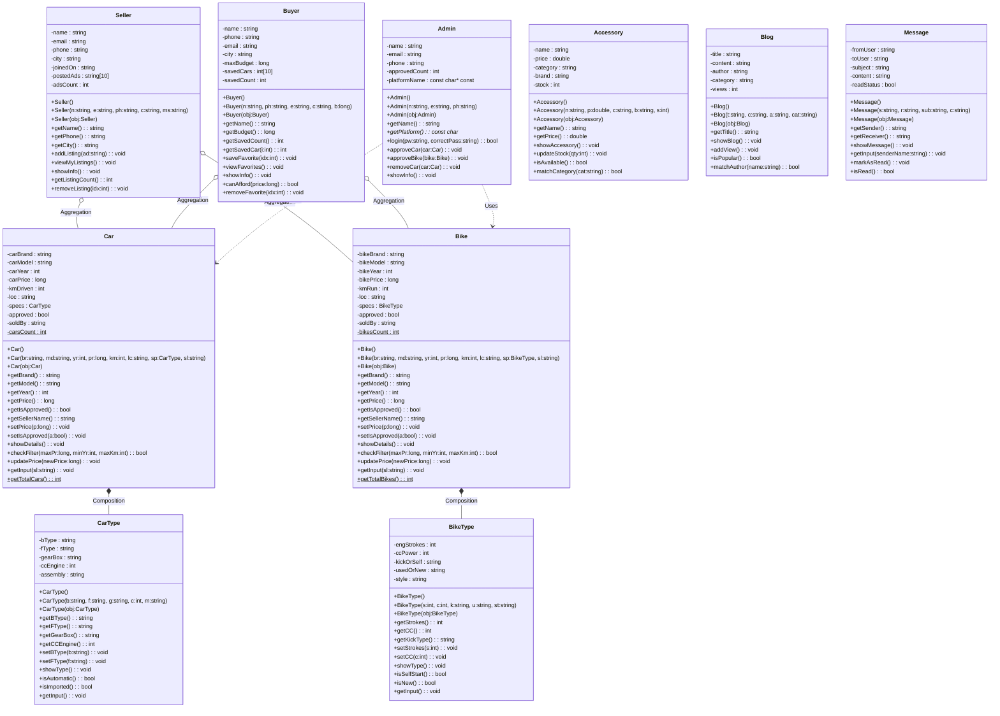

# SlowWheels Class Diagram

```mermaid
classDiagram
    class CarType {
        -bType : string
        -fType : string
        -gearBox : string
        -ccEngine : int
        -assembly : string
        +CarType()
        +CarType(b:string, f:string, g:string, c:int, m:string)
        +CarType(obj:CarType)
        +getBType() : string
        +getFType() : string
        +getGearBox() : string
        +getCCEngine() : int
        +setBType(b:string) : void
        +setFType(f:string) : void
        +showType() : void
        +isAutomatic() : bool
        +isImported() : bool
        +getInput() : void
    }

    class BikeType {
        -engStrokes : int
        -ccPower : int
        -kickOrSelf : string
        -usedOrNew : string
        -style : string
        +BikeType()
        +BikeType(s:int, c:int, k:string, u:string, st:string)
        +BikeType(obj:BikeType)
        +getStrokes() : int
        +getCC() : int
        +getKickType() : string
        +setStrokes(s:int) : void
        +setCC(c:int) : void
        +showType() : void
        +isSelfStart() : bool
        +isNew() : bool
        +getInput() : void
    }

    class Car {
        -carBrand : string
        -carModel : string
        -carYear : int
        -carPrice : long
        -kmDriven : int
        -loc : string
        -specs : CarType
        -approved : bool
        -soldBy : string
        -carsCount : int$
        +Car()
        +Car(br:string, md:string, yr:int, pr:long, km:int, lc:string, sp:CarType, sl:string)
        +Car(obj:Car)
        +getBrand() : string
        +getModel() : string
        +getYear() : int
        +getPrice() : long
        +getIsApproved() : bool
        +getSellerName() : string
        +setPrice(p:long) : void
        +setIsApproved(a:bool) : void
        +showDetails() : void
        +checkFilter(maxPr:long, minYr:int, maxKm:int) : bool
        +updatePrice(newPrice:long) : void
        +getInput(sl:string) : void
        +getTotalCars() : int$
    }

    class Bike {
        -bikeBrand : string
        -bikeModel : string
        -bikeYear : int
        -bikePrice : long
        -kmRun : int
        -loc : string
        -specs : BikeType
        -approved : bool
        -soldBy : string
        -bikesCount : int$
        +Bike()
        +Bike(br:string, md:string, yr:int, pr:long, km:int, lc:string, sp:BikeType, sl:string)
        +Bike(obj:Bike)
        +getBrand() : string
        +getModel() : string
        +getYear() : int
        +getPrice() : long
        +getIsApproved() : bool
        +getSellerName() : string
        +setPrice(p:long) : void
        +setIsApproved(a:bool) : void
        +showDetails() : void
        +checkFilter(maxPr:long, minYr:int, maxKm:int) : bool
        +updatePrice(newPrice:long) : void
        +getInput(sl:string) : void
        +getTotalBikes() : int$
    }

    class Seller {
        -name : string
        -email : string
        -phone : string
        -city : string
        -joinedOn : string
        -postedAds : string[10]
        -adsCount : int
        +Seller()
        +Seller(n:string, e:string, ph:string, c:string, ms:string)
        +Seller(obj:Seller)
        +getName() : string
        +getPhone() : string
        +getCity() : string
        +addListing(ad:string) : void
        +viewMyListings() : void
        +showInfo() : void
        +getListingCount() : int
        +removeListing(idx:int) : void
    }

    class Buyer {
        -name : string
        -phone : string
        -email : string
        -city : string
        -maxBudget : long
        -savedCars : int[10]
        -savedCount : int
        +Buyer()
        +Buyer(n:string, ph:string, e:string, c:string, b:long)
        +Buyer(obj:Buyer)
        +getName() : string
        +getBudget() : long
        +getSavedCount() : int
        +getSavedCar(i:int) : int
        +saveFavorite(idx:int) : void
        +viewFavorites() : void
        +showInfo() : void
        +canAfford(price:long) : bool
        +removeFavorite(idx:int) : void
    }

    class Admin {
        -name : string
        -email : string
        -phone : string
        -approvedCount : int
        -platformName : const char* const
        +Admin()
        +Admin(n:string, e:string, ph:string)
        +Admin(obj:Admin)
        +getName() : string
        +getPlatform() : const char*
        +login(pw:string, correctPass:string) : bool
        +approveCar(car:Car) : void
        +approveBike(bike:Bike) : void
        +removeCar(car:Car) : void
        +showInfo() : void
    }

    class Accessory {
        -name : string
        -price : double
        -category : string
        -brand : string
        -stock : int
        +Accessory()
        +Accessory(n:string, p:double, c:string, b:string, s:int)
        +Accessory(obj:Accessory)
        +getName() : string
        +getPrice() : double
        +showAccessory() : void
        +updateStock(qty:int) : void
        +isAvailable() : bool
        +matchCategory(cat:string) : bool
    }

    class Blog {
        -title : string
        -content : string
        -author : string
        -category : string
        -views : int
        +Blog()
        +Blog(t:string, c:string, a:string, cat:string)
        +Blog(obj:Blog)
        +getTitle() : string
        +showBlog() : void
        +addView() : void
        +isPopular() : bool
        +matchAuthor(name:string) : bool
    }

    class Message {
        -fromUser : string
        -toUser : string
        -subject : string
        -content : string
        -readStatus : bool
        +Message()
        +Message(s:string, r:string, sub:string, c:string)
        +Message(obj:Message)
        +getSender() : string
        +getReceiver() : string
        +showMessage() : void
        +getInput(senderName:string) : void
        +markAsRead() : void
        +isRead() : bool
    }

    Car *-- CarType : Composition
    Bike *-- BikeType : Composition
    Seller o-- Car : Aggregation
    Seller o-- Bike : Aggregation
    Buyer o-- Car : Aggregation
    Buyer o-- Bike : Aggregation
    Admin ..> Car : Uses
    Admin ..> Bike : Uses
```
