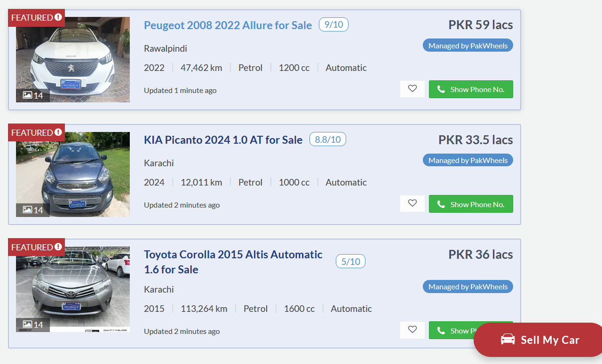
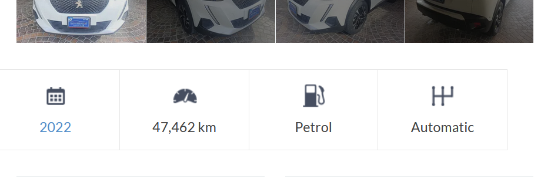
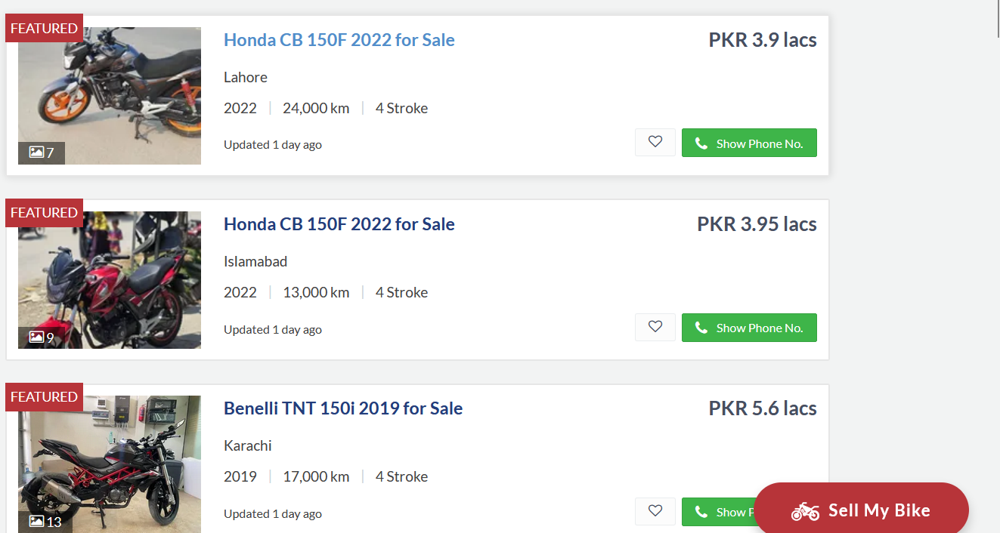
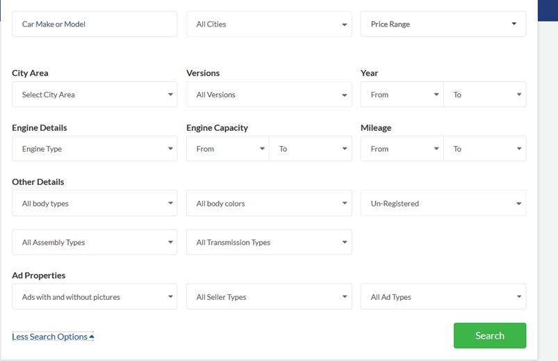
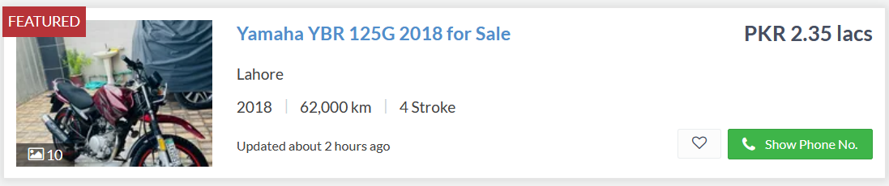
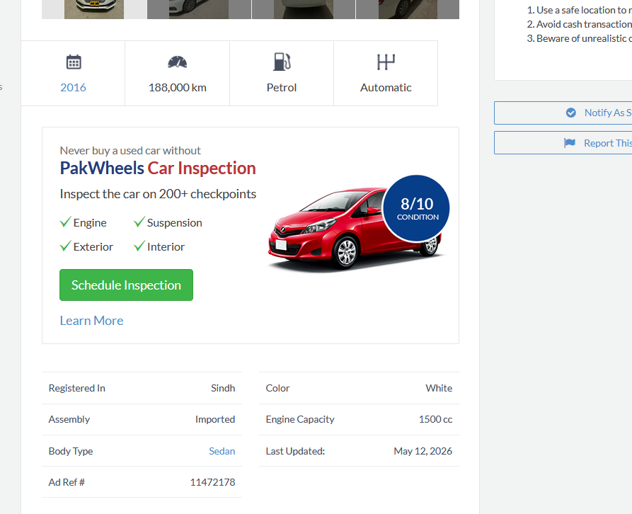
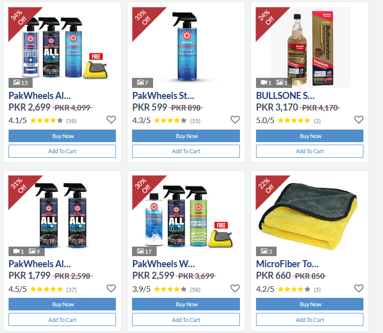

#  Slow-Wheels Assignment 2


**Mohammad Sarim Raza** 25K-0075 &nbsp;·&nbsp; BAI-2C

</div>

---

## Table of Contents

| # | Feature | OOP Concept |
|---|---------|-------------|
| 1 | [Car Listing](#car-listing) | Inheritance, Polymorphism |
| 2 | [Car Specs](#car-specs) | Composition |
| 3 | [Bike Listing](#bike-listing) | Inheritance, Polymorphism |
| 4 | [Search Filter](#search-filter) | Abstraction, Overriding |
| 5 | [Seller Details / Messaging](#seller-details--sending-message-to-seller) | Inheritance |
| 6 | [Posting Ads](#posting-ads) | Abstraction, Overriding |
| 7 | [Approve / Remove Ads / Login](#approve--remove-ads--login) | Inheritance |
| 8 | [Favorites](#add-vehicle-in-favorites--remove) | Inheritance |
| 9 | [Blog](#blog) | Classes |
| 10 | [Inheritance](#inheritance) | Inheritance |
| 11 | [Polymorphism](#polymorphism) | Polymorphism |
| 12 | [Abstraction](#abstraction) | Abstraction |
| 13 | [Operator Overloading](#operator-overloading) | Operator Overloading |
| 14 | [Friend Functions](#friend-functions) | Friend Functions |

---

## Car Listing



```cpp
void showDetails() const override
{
    cout << brand << " " << model << " " << year << " - Available" << endl;
    cout << "  Location: " << location << endl;
    cout << "  " << year << " | " << kmDriven << " km | ";
    specs.showType();
    cout << endl;
    cout << "  Rs. " << price << endl;
    cout << "  Posted by: " << soldBy << "\n" << endl;
}
```

The Pakwheels website shows a list of cars with their details. In our code its implemented by storing cars in an array called carList[]. When user selects option 1 from menu to Show Cars, we loop through each car and call showDetails() from Car.h which prints the car specs as shown in the image. In Assignment 2, Car now inherits from the abstract Vehicle class so fields like brand, model and price are inherited from Vehicle as protected members instead of being declared inside Car directly.

---

## Car Specs



```cpp
void showType() const
{
    cout << fType << " | " << ccEngine << " cc | " << gearBox;
}

bool isAutomatic() const
{
    return gearBox == "Automatic";
}

bool isImported() const
{
    return assembly == "Imported";
}
```

After clicking a specific car from the car listing page we are shown specifications like Petrol/Diesel, CC, and Transmission. In our code a separate class CarType stores these specs. The showType() function displays fuel type, engine CC, and gearbox type. Each Car object has a CarType object inside it which is composition. This part is unchanged from Assignment 1.

---

## Bike Listing



```cpp
void showDetails() const override
{
    cout << brand << " " << model << " " << year << " - Available" << endl;
    cout << "  Location: " << location << endl;
    cout << "  " << year << " | " << kmDriven << " km | ";
    specs.showType();
    cout << endl;
    cout << "  Start: " << (specs.isSelfStart() ? "Self" : "Kick") << endl;
    cout << "  Rs. " << price << endl;
    cout << "  Posted by: " << soldBy << "\n" << endl;
}
```

Similar to cars bikes are stored in bikeList[] array. The showDetails() function in Bike class prints bike info. BikeType class stores bike specs like strokes, engine CC, kick or self start as shown in the image. In Assignment 2, Bike also inherits from Vehicle so all shared fields like brand, model, year and price are now in the Vehicle base class. The bike version of showDetails() also shows kick/self start info which cars dont show, this is polymorphism.

---

## Search Filter



```cpp
bool checkFilter(long maxPr, int minYr, int maxKm) const override
{
    if (maxPr > 0 && price > maxPr) return false;
    if (minYr > 0 && year < minYr) return false;
    if (maxKm > 0 && kmDriven > maxKm) return false;
    return true;
}
```

PakWheels lets users filter cars by a lot of options but I have included the important ones only price, year, mileage. Our checkFilter() function takes max price, min year, and max mileage. It returns true only if the car matches all conditions. We loop through all cars and only show those where checkFilter() returns true. In Assignment 2, checkFilter() is declared as a pure virtual function in the abstract Vehicle class and overridden in both Car and Bike.

---

## Seller Details / Sending Message to Seller


```cpp
void showInfo() const override
{
    cout << "Name: " << name << " | Contact: " << phone << " | City: " << city << endl;
}

void addListing(string ad)
{
    if (adsCount < 10)
        postedAds[adsCount++] = ad;
}

void getInput(string senderName)
{
    fromUser = senderName;
    cout << "Send To: "; cin >> toUser;
    cout << "Title: "; cin >> subject;
    cout << "Content: "; cin >> content;
}
```

After we click on car in Carlisting page a new page opens which shows the seller info and also give option to message the Seller. Seller info is stored in Seller class with name, phone, city, and member since date. The showInfo() function displays seller details. In Assignment 2, Seller inherits from the abstract User class so name, phone and city are now protected fields from User. For messaging, Message class stores sender, receiver, subject and content. The getInput() function asks user to type message if he wants to.

---

## Posting Ads


```cpp
void getInput(string sl) override
{
    soldBy = sl;
    cout << "Brand Name: "; cin >> brand;
    cout << "Model Name: "; cin >> model;
    cout << "Model Year: "; cin >> year;
    cout << "Asking Price: "; cin >> price;
    cout << "KM Driven: "; cin >> kmDriven;
    cout << "Location: "; cin >> location;
    specs.getInput();
    carsCount++;
}
```

When seller wants to post a car ad, we call getInput() function of Car class. It asks user to enter brand, model, year, price, mileage, and location one by one. Then it also calls CarType.getInput() to get the specs. The new car is added to carList[] array. In Assignment 2, getInput() is declared as a pure virtual function in Vehicle and overridden in Car and Bike separately since each vehicle type has different spec inputs.

---

## Approve / Remove Ads / Login

```cpp
void approveCar(Car& car)
{
    car.setIsApproved(true);
    approvedCount++;
}

void approveBike(Bike& bike)
{
    bike.setIsApproved(true);
    approvedCount++;
}

void removeCar(Car& car)
{
    car.setIsApproved(false);
    cout << "Listing removed by admin" << endl;
}

bool login(string pw, string correctPass) const
{
    return pw == correctPass;
}
```

This is an admin only feature so cant show its screenshot from website, Its on the backside of Website not shown to a user. In our code, Admin class has approveCar() which sets cars approved status to true. removeCar() sets it back to false. Admin can also login using login() function which checks the password. In Assignment 2, Admin inherits from User so name, email and phone are inherited as protected fields. Admin overrides showInfo() to show the admin name and number of ads approved.

---

## Add Vehicle in Favorites / Remove


```cpp
void saveFavorite(int idx)
{
    if (savedCount < 10)
        savedCars[savedCount++] = idx;
}

void viewFavorites() const
{
    cout << name << " - Saved Cars:" << endl;
    for (int i = 0; i < savedCount; i++)
        cout << "  Car #" << savedCars[i] << endl;
}

void removeFavorite(int idx)
{
    for (int i = 0; i < savedCount; i++)
    {
        if (savedCars[i] == idx)
        {
            for (int j = i; j < savedCount - 1; j++)
                savedCars[j] = savedCars[j + 1];
            savedCount--;
            break;
        }
    }
}
```

Buyer can save favorite cars on Pakwheels website after clicking the heart icon as highlighted in image. So this is implemented in the code in the Buyer class it has a savedCars[] array that stores car index numbers. saveFavorite() adds a car index from carlist[] array. removeFavorite() removes it by shifting other entries. viewFavorites() shows all saved cars using the index stored in savedCars[] array. In Assignment 2, Buyer inherits from User so name, phone and city come from the User base class.

---

## Blog


```cpp
void showBlog() const
{
    cout << title << " | Writer: " << author << " | Read: " << views << " times" << endl;
    cout << "  " << content << endl;
}

void addView()
{
    views++;
}
```

PakWheels has a blog section and its implemented in our code as well. Our Blog class stores title, content, author, and view count. showBlog() displays the blog post details while addView() increases the view counter by 1 each time someone reads the blog. This part is unchanged from Assignment 1.

---

## Inheritance


```cpp
// User is the base - Seller, Buyer and Admin all inherit from it
class User { protected: string name, email, phone, city; };
class Seller : public User { ... };
class Buyer  : public User { ... };
class Admin  : public User { ... };

// Vehicle is the base - Car and Bike both inherit from it
class Vehicle { protected: string brand, model; long price; ... };
class Car  : public Vehicle { private: CarType specs; ... };
class Bike : public Vehicle { private: BikeType specs; ... };

// Product is the base - Accessory inherits from it
class Product   { ... };
class Accessory : public Product { ... };
```

In Assignment 1, Seller, Buyer and Admin each had their own name, email, phone and city fields written separately. Car and Bike also had duplicate fields like brand, model, year and price. In Assignment 2 we used inheritance to fix this. All user types inherit from a common User base class which holds the shared data. Car and Bike both inherit from a common Vehicle base class. Accessory inherits from Product. This removes repeated code and models the real structure of Pakwheels where every account is a type of user and every listing is a type of vehicle.

---

## Polymorphism

### Function Overriding

| Car Card | Bike Card |
|----------|-----------|
|  |  |

```cpp
// In Vehicle.h - pure virtual, forces Car and Bike to implement their own version
virtual void showDetails() const = 0;

// In Car.h - shows fuel type, CC, transmission
void showDetails() const override
{
    cout << brand << " " << model << " " << year << " - Available" << endl;
    cout << "  " << year << " | " << kmDriven << " km | ";
    specs.showType();
    cout << "  Rs. " << price << endl;
}

// In Bike.h - shows kick/self start instead of fuel type
void showDetails() const override
{
    cout << brand << " " << model << " " << year << " - Available" << endl;
    cout << "  " << year << " | " << kmDriven << " km | ";
    specs.showType();
    cout << "  Start: " << (specs.isSelfStart() ? "Self" : "Kick") << endl;
    cout << "  Rs. " << price << endl;
}
```

As shown in the images above both car card and bike card call the same showDetails() function but both operate differently. Cars specs and details are different from bike so even though its the same function name the output is different. Car shows fuel type, CC and transmission while bike shows kick or self start instead. In our code showDetails() is declared as pure virtual in Vehicle and overridden separately in Car and Bike. This is function overriding.

---

### Function Overloading (Extended Specs)



```cpp
// Basic version - shows listing card info
void showDetails() const override { ... }

// Extended version - shows full specs when clicking on a specific car
void showDetails(bool fullSpecs) const
{
    showDetails();
    if (fullSpecs)
    {
        cout << "  Body Type  : " << specs.getBType() << endl;
        cout << "  Assembly   : " << (specs.isImported() ? "Imported" : "Local") << endl;
        cout << "  Automatic  : " << (specs.isAutomatic() ? "Yes" : "No") << endl;
    }
}
```

When we click on a specific car on Pakwheels it shows its full specs like body type and assembly which are not shown on the listing card. In our code showDetails() is used again but this time its overloaded with a second version that takes a bool fullSpecs. When fullSpecs is true it prints the extra specs on top of the basic info. Having two functions with the same name but different parameters is function overloading.

---

## Abstraction

| Nav Bar | Store Products |
|---------|----------------|
|  |  |

```cpp
// User.h - abstract, cannot be created directly
class User
{
protected:
    string name, email, phone, city;
public:
    virtual void showInfo() const = 0;
    virtual string getRole() const = 0;
};

// Vehicle.h - abstract, cannot be created directly
class Vehicle
{
protected:
    string brand, model, location, soldBy;
    int year, kmDriven;
    long price;
    bool approved;
public:
    virtual void showDetails() const = 0;
    virtual bool checkFilter(long maxPr, int minYr, int maxKm) const = 0;
    virtual void getInput(string sl) = 0;
};

// Product.h - abstract, cannot be created directly
class Product
{
public:
    virtual void display() const = 0;
    virtual double getPrice() const = 0;
    virtual bool isAvailable() const = 0;
};
```

As shown in the first image Pakwheels has Used Cars, New Cars and Bikes all in the nav bar. All of these are vehicles so in our code we made an abstract class Vehicle which has all the common attributes like brand, model, year and price. Functions like showDetails(), checkFilter() and getInput() are also declared in Vehicle but since cars and bikes work differently these are pure virtual (= 0) and overridden separately in Car and Bike. You cant create a Vehicle object directly, it only tells what every vehicle type must have and do.

As shown in the second image Pakwheels store has different products like accessories and parts. These may have different quantities, usecases and work differently from each other so in our code Product is also an abstract class. It forces Accessory to implement its own display(), getPrice() and isAvailable(). The abstract class just defines what every product must do, it cant be created directly on its own.

---

## Operator Overloading



```cpp
// Car.h - operator== checks if two cars are the same listing
bool operator==(const Car& other) const
{
    return brand == other.brand && model == other.model && year == other.year;
}

// Car.h - operator< compares prices to find cheaper car
bool operator<(const Car& other) const
{
    return price < other.price;
}

// Buyer.h - operator== checks for duplicate accounts
bool operator==(const Buyer& other) const
{
    return name == other.name && phone == other.phone;
}

// Accessory.h - operator+ combines two accessories into a bundle
Accessory operator+(const Accessory& other) const
{
    Accessory bundle;
    bundle.name = name + " + " + other.name;
    bundle.price = price + other.price;
    bundle.category = "Bundle";
    return bundle;
}
```

As shown in the image Pakwheels store has accessories bundled together as combos. So in our code we overloaded the + operator in Accessory class so we can combine two accessories into one bundle with combined name and price, just like those combo deals shown in the image.

Other than that operator overloading is also used for cars and buyers. For cars we overloaded == to compare brand, model and year to check if two listings are the same car, and we overloaded < to compare prices to find which is cheaper, this makes filtering easy. For buyers we overloaded == to compare name and phone number, this prevents double registration since no two buyers should have the same name and phone number.

---

## Friend Functions


```cpp
// Declared inside Car class in Car.h
friend void printCarInfo(const Car& c);
friend bool comparePrices(const Car& c1, const Car& c2);

// Declared inside Bike class in Bike.h
friend void printBikeInfo(const Bike& b);

// All three defined in main.cpp
void printCarInfo(const Car& c)
{
    cout << "Brand  : " << c.brand << "  Model: " << c.model << endl;
    cout << "Price  : Rs. " << c.price << endl;
    c.specs.showType();
}

bool comparePrices(const Car& c1, const Car& c2)
{
    return c1.price < c2.price;
}

void printBikeInfo(const Bike& b)
{
    cout << "Brand  : " << b.brand << "  Model: " << b.model << endl;
    cout << "Price  : Rs. " << b.price << endl;
    b.specs.showType();
}
```

As shown in the image when we click on a car on Pakwheels it shows its full detail specs and seller details all together. In our code this is done using friend functions. A friend function is declared inside a class using the friend keyword, its not a member of the class but it can directly access all private and protected members without any restriction. We added three friend functions. printCarInfo accesses private specs and price from Car to print a full car report as shown in the image. comparePrices reads the private price of two cars directly to compare them, used in the compare cars feature. printBikeInfo does the same for Bike. All three are declared inside their class and defined in main.cpp.
